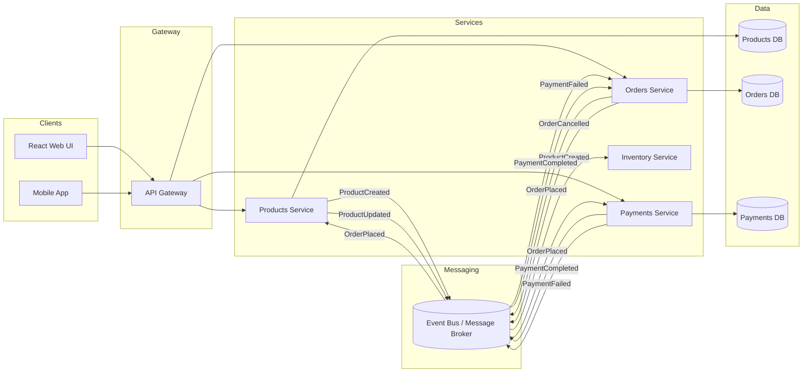

# Event-Driven Architecture

This diagram shows how the Products service fits into a distributed microservices architecture alongside Orders and Payments.

## Flow examples

1. **Product created** — Products service persists the product and publishes `ProductCreated`. Inventory service consumes the event to update stock projections.
2. **Order placed** — Orders service publishes `OrderPlaced`. Products service validates availability; Payments service starts payment processing.
3. **Payment completed** — Payments service publishes `PaymentCompleted`. Orders service marks the order as paid and triggers fulfilment.

## Why event-driven?

- **Loose coupling** — Services evolve independently behind well-defined events.
- **Scalability** — Read-heavy product catalog traffic is isolated from order/payment workloads.
- **Resilience** — Temporary downstream failures can be retried asynchronously via the broker.

## Products service responsibilities

- Own product master data (name, colour, price)
- Expose secured CRUD/query APIs
- Publish product lifecycle events for downstream consumers
- Remain the system of record for product information
